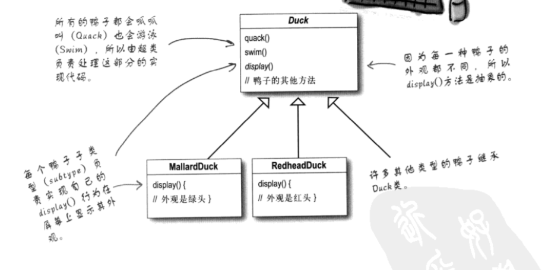
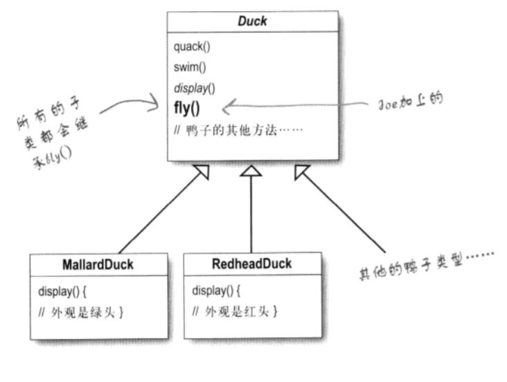
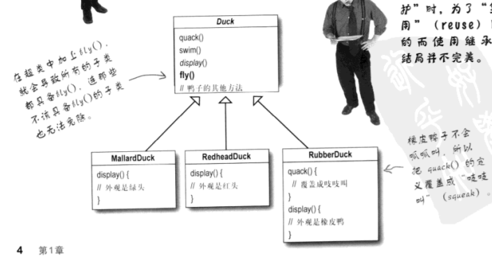
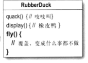
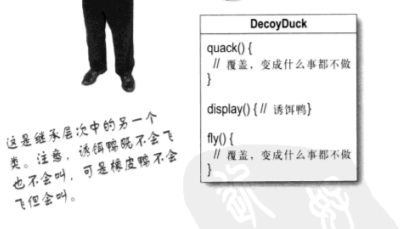
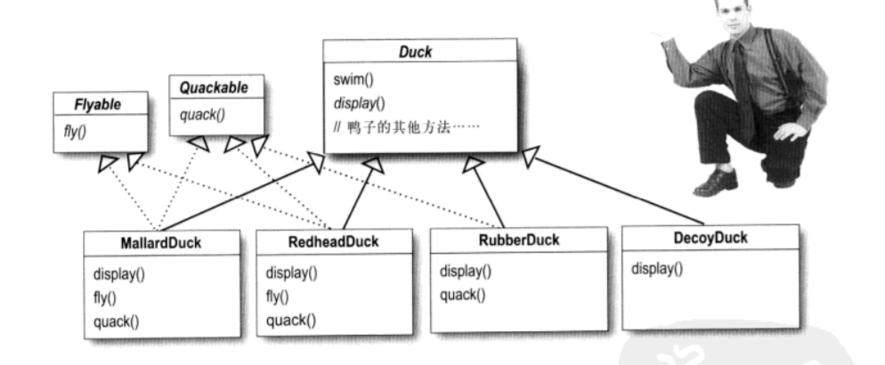
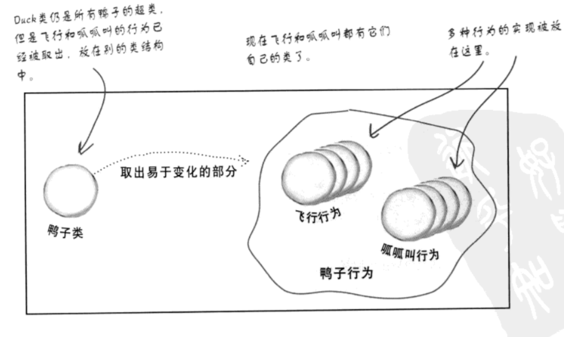
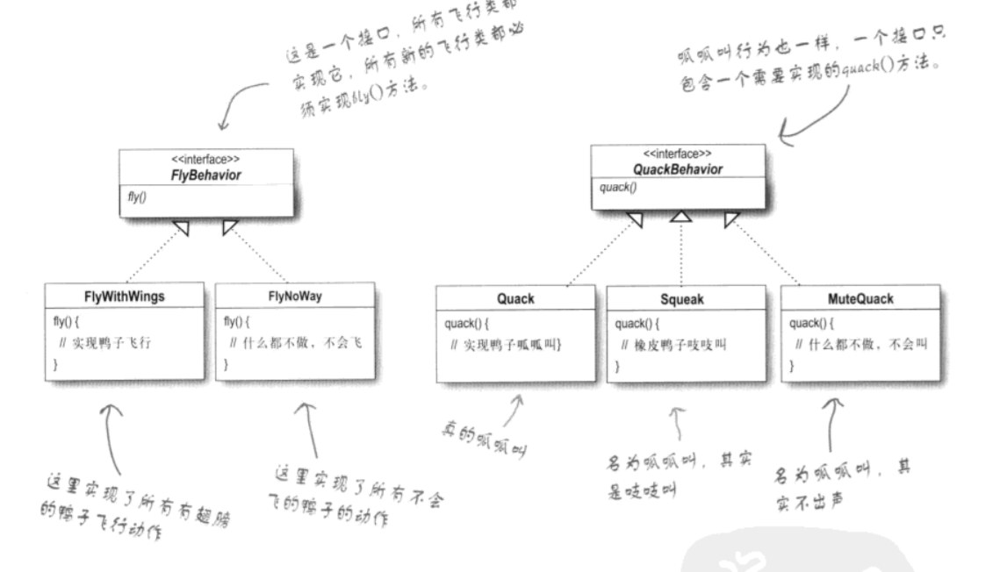
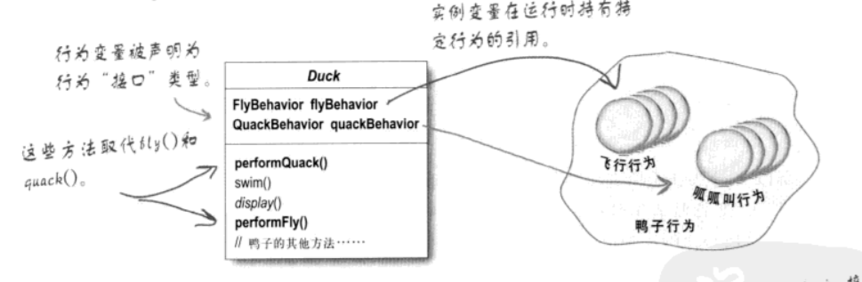

# 策略模式

**意图：**定义一系列的算法,把它们一个个封装起来, 并且使它们可相互替换。此设计模式让算法的变化独立于使用算的客户

## 案例

假如说公司做了一套鸭子游戏，鸭子能够游泳以及发出叫声。这个系统使用了标准的oo技术，设计了一个鸭子的超类，并让其他鸭子继承这个基类，只需要重写display函数就行，quack和swim都已经实现好了。

接着由于游戏做的太好，所以新的需求来了，需要加一些会飞的鸭子，为了达到复用的效果。我们可能会直接加一个方法

这就造成一些其他问题，原本的不会飞的鸭子飞了起来，或者后来加的不需要飞的鸭子也飞了起来。

这时你想到可以把fly()重写一下，改成什么都不做

但是如果不飞的鸭子数量增加，每个都这么写似乎比较麻烦，而且在我看来是很不完美的。这个问题同样出现在quack和display上，比如我要加一个不会叫的鸭子，那就需要将display重写，注释成什么都不用做，伤脑筋似乎比较难维护。

不仅代码会在多个子类中重复，而且运行时行为不好改变，并且如果后续继续加需求，会导致牵一发而动全身。

这时有人又提出了另外的方法，使用接口。我们将行为抽象出来，如果有什么行为直接继承即可。

这个方法复用性很差，会有许多重复的代码，维护起来难度也很大。

### 解决方法

策略模式。

设计原则：

1.找出应用中可能需要变化之处，把它独立出来，不要和纳希俄不需要变化的代码混合在一起。

2.针对接口编程，而不是针对实现编程。这里的针对接口编程，是指针对超类型编程。

### 鸭子的行为

我们设计两个接口FlyBehavior和QuackBehavior，实现他们对应的类

这样来的好处：可以让飞行混合呱呱叫的动作被对象复用，因为这些行为已经和鸭子无关。并且我们可以新增一些行为，不会影响既有的行为类，也不会影响“使用”飞行行为的鸭子类

这个时候我们的Duck基类可以这样设计，通过set或者初始化的方法我们可以设置行为

### 具体实现

